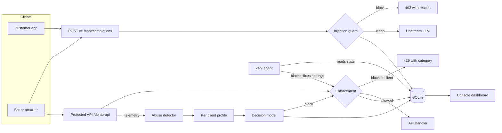

# Aegis

[](https://www.python.org/)
[](https://docs.docker.com/)
[](LICENSE)
[]()
[]()
[]()

Aegis is a small, self hosted guard that sits in front of LLM APIs. It reads the
requests and the client telemetry, decides allow or block with a model that was
trained for exactly that, and blocks bad clients while their requests are still
in flight. When something slips past the automatic rules, a 24/7 agent checks
the live state and acts.

Everything runs on one machine. Data goes in, nothing goes out.

## What is different here

Small guard models are not new. Meta ships Llama Prompt Guard for prompt
injection, and there are classifier based firewalls for LLM traffic. What we
could not find anywhere else, as of September 2026, is this exact combination:

- An end-to-end guard whose decision layer is a System 1 decision model (Laya)
  for both prompt injection and API abuse, with per question confidences and
  thresholds instead of one unsafe score.
- An agent that does more than classify. It runs 24/7, blocks clients and
  corrects settings on its own, and every action lands in an audit trail. The
  classifier projects we looked at only report.
- The whole thing self hosted in one process: console, dashboard, persistent
  device blacklist, and a distilled student that answers inline in
  microseconds, with no cloud call per decision.

To be exact about the claim: the concept of a small model for security
decisions has prior art, and Laya has been evaluated for agent security before.
Our claim is the end-to-end product shape, not the idea.

## Why

Rate limits and signatures miss the attacks that matter:

- Prompt injection looks like one normal chat message. There is no volume spike.
- A real API key walking IDs it has never touched stays under every rate limit. Only behaviour gives it away.
- Dashboards report damage after the fact. A block only matters if it happens during the request.
- Alerts do not act. An unhandled verdict or an unapplied rule just sits there.

## Features

### Prompt injection firewall

- Screens every request before it reaches the upstream model.
- Built on the Laya decision models, not on a general chat LLM.
- Per question thresholds: prompt injection, hidden instructions, secret requests.
- Rule layer for the cases the model confuses: system prompt extraction, benign prompt authoring, plain greetings.
- Distilled student fast path for inline checks with a conservative threshold, so high confidence attacks are dropped in microseconds while everything else goes to the full model.
- `block` and `monitor` modes, per request override with `X-Guard-Mode`.

### API abuse detector

- Takes request telemetry from your gateway, metadata only.
- Builds live per client profiles: rate, cadence, endpoint spread, ID walks, error mix, auth failures, user agent, ASN.
- Cheap triggers decide when the model runs, so the guard stays fast under load.
- The model returns a category: scraping, credential stuffing, integration burst, fuzzing, flooding.
- Score policy: `mean(is_abuse, true_positive)` against a calibrated threshold, with a severity floor.
- Clients are blocked for a TTL and every decision is stored with the narrative the model read.

### In flight enforcement

- Chat requests: `403` with the reason, the request never reaches the model.
- Protected API: `429` with the category and the retry window.
- Clean clients are never touched. Verified live: benign browsing and a legit poller completed while four attack streams were cut off mid run.

### 24/7 agent monitor

- Runs on its own loop (default every 20 seconds).
- Looks for what enforcement missed: unhandled block verdicts, blacklist rules that are not applied, enforcement switched off while attacks are live.
- Acts in `act` mode: blocks the client, re-applies rules, corrects settings. In `monitor` mode it only proposes and logs.
- Optional model review: the snapshot goes to the upstream LLM as strict JSON actions, validated before execution, with a deterministic policy fallback when the model is unavailable.
- Chat interface: ask for the live state, or command it. Block and unblock devices, change modes, thresholds, TTLs, run a scan.
- Every action is audited with source and reason.

### Console

- First run setup, sessions, password change.
- Dashboard: live guard and abuse traffic, block rate, blocked clients, abuse categories, hourly history, recent activity.
- Decisions: full log for both detectors with thresholds, probabilities, triggers and narratives.
- Clients: telemetry ranking with block state.
- Devices: persistent blacklist. Block any IP or key for 1 hour, 24 hours, 7 days or permanently, with a reason. Rules survive restarts. One click unblock.
- Agent: enable, mode, interval, model review, run now, action history, chat.
- Settings: modes, thresholds, TTL, upstream base, model and key, retention window.
- Data retention: default 7 days, purge runs hourly, everything in SQLite.

### Local and small

- No cloud call per decision. The guard, the detector and the agent run in one Python process with SQLite.
- The distilled student handles inline checks in microseconds, so it works on low end machines with no GPU.
- The upstream model is only used for chat replies and the optional agent review. It can be switched off.

### Docker

- One command to build and run, models included.
- Reuses Laya checkpoints already on the host, downloads them once when they are missing.
- Volumes for models, HF cache, database and logs. Healthcheck included.

### Demos and benches

- `/chat`: the firewall in front of the demo chat, with live verdicts.
- `/api-abuse`: scenario bench that either scores synthetic telemetry or sends real requests at the demo API.
- `demo-scripts/demo_api_scenarios.py`: runs every scenario live and shows each attack stream stop in flight.
- `demo-scripts/aegis_accuracy_chart.py`: renders the measured accuracy figure.
- `demo-scripts/show_db.py`: prints a clean summary of the database for review.
- `guard/tools/`: evals for the guard and the abuse detector, plus the fast path trainer and bench.

## How it works



The same pipeline covers both detectors: requests and telemetry enter one
process, profiles and prompts are scored by the models, decisions are enforced
in flight, and everything is written to SQLite where the console and the agent
read it back.

## Setup with Docker

Docker is the easy path. You need Docker with the compose plugin, then five
steps.

**1. Get the code**

```bash
git clone https://github.com/X3r0Day/aegis.git
cd aegis
```

**2. Models (usually automatic)**

The container reuses Laya checkpoints that are already on the host at
`laya/models/laya`. If that folder is empty, it downloads english and
typed-decisions once (about 1.7 GB) into the same folder and keeps them there.
Nothing else to do.

If your checkpoints live somewhere else, point the setup at them:

```bash
export AEGIS_MODELS=/data/models/laya
```

**3. Upstream key (optional)**

Only needed for chat replies and the optional agent model review. The guard,
the abuse detector and the agent policy all work without it.

```bash
export DEEPSEEK_API_KEY=sk-...
```

**4. Start it**

```bash
docker compose up -d --build
```

First build takes a few minutes (CPU torch). Later starts are instant, the
image is already built.

**5. Open the console**

http://127.0.0.1:8978/console

The first visit shows a setup page. Pick a console password (8 characters or
more), sign in, and you land on the dashboard. The machine endpoints under
`/v1/` stay open for your apps and gateways.

### Day to day

```bash
docker compose logs -f          # live logs
docker compose down             # stop
docker compose up -d --build    # update after git pull
```

State lives in volumes, so rebuilds keep it:

- `./laya/models` checkpoints and HF cache
- `./guard/data` SQLite database: settings, decisions, blacklist, agent audit
- `./guard/logs` raw JSONL decision feeds

### Docker troubleshooting

- Port 8978 already in use: stop the local server or another container on that port, or change the port mapping in `docker-compose.yml`.
- `checkpoints missing` in the logs: the first start is downloading, wait for it, or set `AEGIS_MODELS` to an existing folder.
- Container unhealthy: `docker compose logs aegis` prints the reason. The healthcheck hits `/health` on port 8978.
- Need to change a model or key later: everything is editable in the console under Settings, no rebuild needed.

## Setup without Docker

```bash
python3.12 -m venv .venv
.venv/bin/pip install -r requirements.txt
HF_HOME=laya/models/hf .venv/bin/python laya/download_models.py english typed-decisions
.venv/bin/python guard/app.py
```

Then open http://127.0.0.1:8978/console and create the console password. The
database is written to `guard/data/aegis.db` unless `AEGIS_DB` says otherwise.
Windows notes live in `guard/README.md`.

## Measured results

Live runs, all on one CPU machine:

| check | result |
|---|---|
| prompt injection eval (rules included) | 22/22 |
| prompt attacks blocked in live checks | 8/8 |
| benign prompts allowed in live checks | 8/8 |
| attack scenarios stopped in flight | 4/4 |
| successful attack runs | 0 |
| scenarios that completed untouched (benign) | 2/2 |
| fast path decision latency | 309 microseconds median |
| full guard HTTP round trip with fast path | about 2 ms |

Scenario detail: scraper served 576 requests then cut off at 12.8s, credential
stuffing cut at 10.1s, burst cut at 12.5s, fuzzer cut at 1.3s. Reproduction:
`demo-scripts/demo_api_scenarios.py`, chart: `docs/aegis-accuracy.png`.

## Repo layout

```
guard/              guard server, console, agent and framework
  app.py            FastAPI app: chat firewall, telemetry, demo API
  console.py        console backend: sessions, settings, dashboard API
  store.py          SQLite: decisions, blocks, rules, agent events
  agent.py          24/7 monitor: policy, optional model review, chat
  laya_guard/       the framework: guard, abuse detector, rules, fast path
  webui/            console pages and static files
  tools/            demos, evals, fast path training
laya/               Laya model setup and the raw playground
demo-scripts/       live scenarios, accuracy chart, database summary
docs/               slide deck, accuracy figure, deck generator
```

## Configuration

Settings live in the console and are stored in SQLite. They take precedence
over environment variables at startup.

| variable | purpose |
|---|---|
| `DEEPSEEK_API_KEY` | upstream key for chat replies and agent review |
| `AEGIS_DB` | SQLite file location (default `guard/data/aegis.db`) |
| `AEGIS_MODELS` | host path for Docker checkpoints |
| `AEGIS_HF` | host path for the Docker HF cache |
| `GUARD_FASTPATH` | set to 1 to enable the distilled student |

More detail on endpoints, the telemetry schema and the fast path lives in
`guard/README.md`.

## Team

Built by:

- [X3r0Day](https://github.com/X3r0Day)
- [vishesh07-codes](https://github.com/vishesh07-codes)
- Sharvan Tyagi
- Shagun Chaudhary
- Arush Verma
- Pakhi Srivastava

## License

MIT. See [LICENSE](LICENSE).
